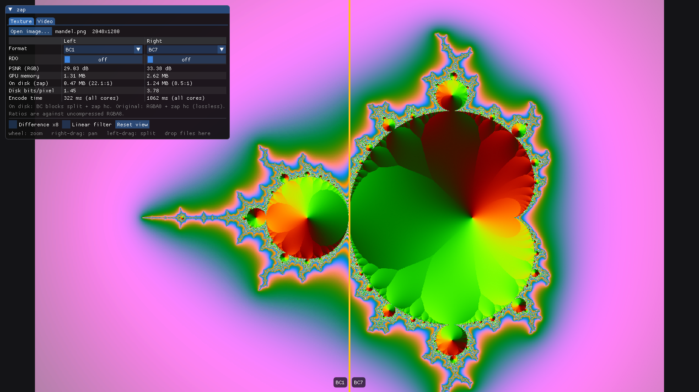
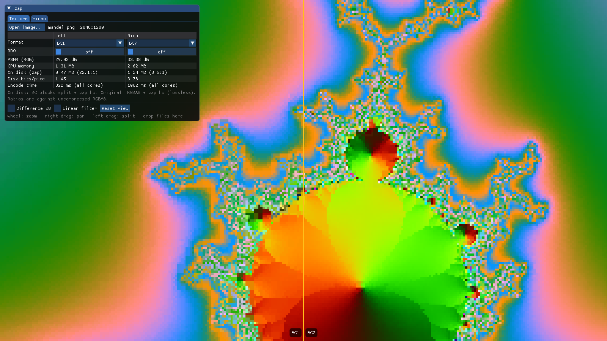
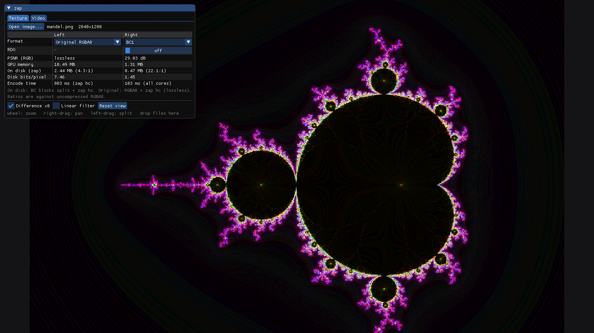
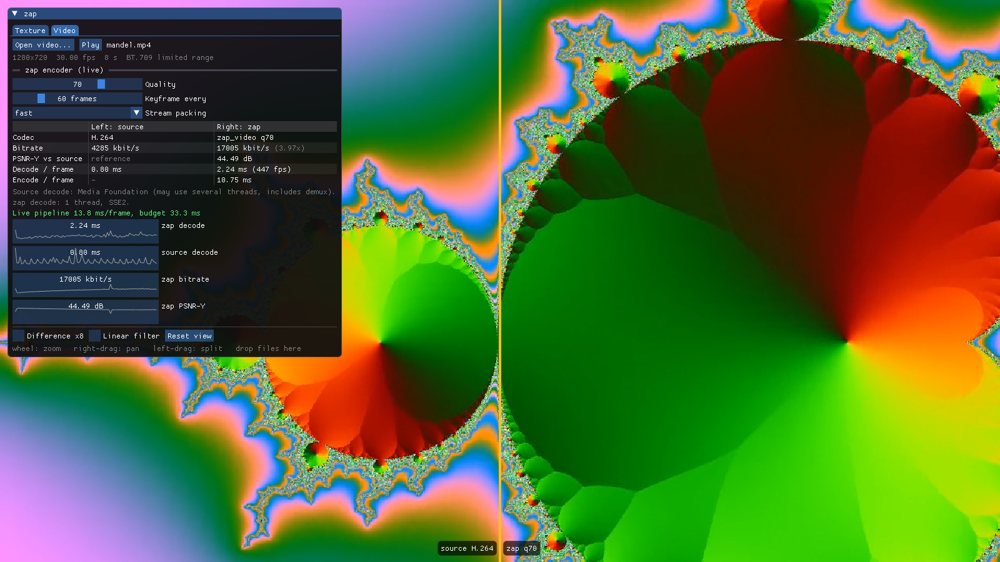
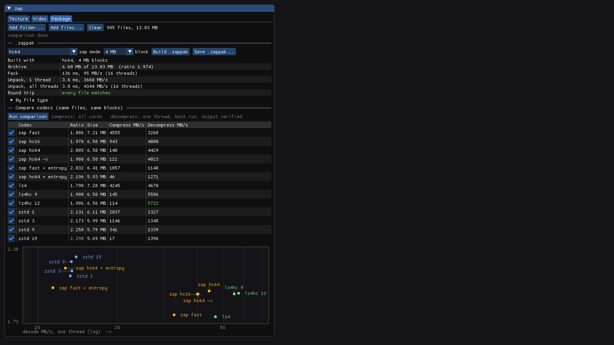

# zap

Single-header C compression for games:

| Header | What it does |
|---|---|
| `zap.h` | Fast LZ77 compressor for **asset packaging** and **network packets**, with an optional Huffman-coded **entropy mode** |
| `zap_tex.h` | GPU texture block compression (**BC1/BC3/BC4/BC5/BC7**, **BC6H** for HDR, and **ASTC 4×4** for mobile) with rate-distortion optimisation tuned for `zap.h`, and **mipmap** generation |
| `zap_video.h` | Simple, fast-decoding **video codec** for cutscenes and UI video (SSE2 decoder) |
| `zap_pak.h` | **.zappak** archives: many named files, one zap frame each, with a sorted table of contents |
| `samples/dx11` | **zap_viewer**: D3D11 + Dear ImGui app that compares encodings of your own images and videos side by side, packages content into .zappak files, and benchmarks zap against LZ4 and zstd |

Each header works on its own, except that `zap_video.h` and `zap_pak.h` include `zap.h`. They're C11 and also compile as C++, with no dependencies.

## Showcase

These screenshots come from [`zap_viewer`](#zap_viewer-windows-d3d11--dear-imgui), the bundled D3D11 + Dear ImGui sample. The test content is a Mandelbrot render and a Mandelbrot zoom clip, both generated with ffmpeg's `mandelbrot` source.

**Textures: BC1 (left) vs BC7 (right)**, with PSNR, GPU memory, size on disk after zap, and encode time for each side:



| Up close, point-sampled (8×): BC1's 4×4 color steps vs BC7 | Difference ×8: where BC1 loses detail against the original |
|---|---|
|  |  |

**Video: an H.264 MP4 (left) transcoded live through zap (right)**, with bitrate, PSNR, per-frame decode and encode times, and plots:



**Package: a folder packed into a .zappak, then the same files through every codec**, with ratio, compress speed (all cores) and single-thread decompress speed, and a ratio vs decode-speed plot. The content here is the LZ4, zstd and Dear ImGui source trees (985 files, 13 MB); drop in your own game content to see how it packs:



Fractal zooms are close to worst-case content for zap. Here zap needs about 4× the H.264 source's bitrate to reach 44.5 dB. The [video benchmarks](#benchmarks) show where it lands on more typical footage.

**zap.h:**

- **One header, no dependencies.** Drop `zap.h` into your project.
- **Fast decode.** About 2.3–3.2 GB/s per core (3.6 GB/s with `ZAP_FAST_DECODE`), and 9–11 GB/s across 8 threads on packaged data.
- **Two compressors, one format.** `fast` runs at hundreds of MB/s for runtime use. `hc` is slower but gives smaller files for offline packaging. At depth 32 and up it runs an optimal parser, which picks the cheapest set of matches for the whole block rather than the best match at each position. That gives smaller files *and* faster decoding. The same decoder reads all of them.
- **Entropy mode.** It re-codes the matches as Huffman streams, with a repeat-offset code. With the optimal parser (two passes, the second priced with the first's Huffman code lengths) it reaches ratio 2.52 at 1.3 GB/s decode, ahead of zstd 9 (2.47 at the same speed).
- **Safe on untrusted input.** Every read and write in the decoder is bounds-checked, and it only writes inside the output buffer you give it. It's fuzzed under AddressSanitizer and UBSan in CI.
- **Packet dictionaries.** Train a shared dictionary once, then compress 50–200 byte packets that would otherwise barely shrink.
- **Parallel frames.** Packaging frames hold independent blocks. Compress or decode them on built-in threads, or hand single blocks to your own job system.
- **Portable output.** The format doesn't depend on byte order: little- and big-endian hosts produce byte-identical output.

## Quick start

### Packaging

```c
#define ZAP_THREADS          /* optional: enables the *_mt functions (pthreads, or C11 threads on Windows) */
#include "zap.h"

/* compress an asset (offline, at build time) */
size_t cap = zap_frame_bound(n, 4 << 20);
void  *out = malloc(cap);
size_t size = zap_frame_compress_mt(asset, n, out, cap, 4 << 20 /* block */, 64 /* hc depth, 0 = fast */, NULL, 8);
/* depth >= 32 = optimal parse.  | ZAP_ENTROPY: ~20% smaller, ~40% of the decode speed (version-2 frame, same decode calls)
   | ZAP_FAST_DECODE: fewer, longer matches -> ~15% faster decode, ~3.5% bigger (plain format) */

/* decompress (at runtime) */
zap_frame f;
if (zap_frame_open(&f, data, size) == 0) {          /* validates the header */
    void *raw = malloc(f.raw);
    zap_frame_decode_mt(data, size, raw, f.raw, NULL, 8);
}
```

To decode with your engine's job system instead of zap's threads, call `zap_frame_open` once, then run `zap_frame_decode_block(&f, i, raw, NULL)` for `i` in `[0, f.nb)`. Each call is independent and thread-safe.

Entropy blocks need scratch memory while decoding. `zap_frame_decode_block` allocates it for each call. For best speed, give each job thread one buffer of `zap_entropy_scratch(f.bs)` bytes and call `zap_frame_decode_block_ex(&f, i, raw, NULL, scratch, size)` instead.

### Networking

```c
/* once, on both ends: build the dictionary from captured traffic */
uint8_t dict_bytes[16384];
size_t  dict_len = zap_dict_train(samples, samples_len, dict_bytes, sizeof dict_bytes);
static zap_dict dict;                  /* ~256KB; read-only after init, share it across threads */
zap_dict_init(&dict, dict_bytes, dict_len);

/* per packet */
static zap_state st;                   /* 256KB scratch, one per sending thread */
size_t c = zap_compress(pkt, pkt_len, wire, sizeof wire, &st, &dict);    /* 0 = didn't fit */
if (!c || c >= pkt_len) { /* send it raw instead, with a flag bit */ }

/* receive: you must know the exact raw size (send it in your packet header) */
if (zap_decompress(wire, c, pkt, raw_len, &dict) < 0) { /* corrupt or hostile: drop it */ }
```

Both ends must use byte-identical dictionaries. Version them in your protocol.

### Textures

```c
#include "zap_tex.h"

size_t n = zap_bc_size(w, h, ZAP_BC1);
uint8_t *bc = malloc(n), *planes = malloc(n);
zap_bc_encode(rgba, w, h, w * 4, ZAP_BC1, 30.0f /* rdo: 0 = max quality */, bc);   /* plain BC1: GPU-ready */

/* for shipping: regroup block fields (lossless), then compress with zap */
zap_bc_split(bc, n, ZAP_BC1, planes);
size_t packed = zap_compress_hc(planes, n, out, cap, hc_state, NULL, 64);

/* at load time: zap_decompress -> zap_bc_merge -> upload the BC1 data */
```

- `rdo` is the rate-distortion trade-off. At 0 every block gets its best encoding. As it rises, blocks increasingly reuse endpoints and indices from recent blocks whenever the extra error is worth the bytes zap saves. The output is still standard BCn, so the GPU and your engine don't change.
- The formats are BC1 (RGB), BC3 (RGBA), BC4 (single channel), BC5 (two channels, for normal maps) and BC7 (high-quality RGBA).
- For BC7, the decoder handles all 8 modes. The encoder uses three:
  - mode 6 for smooth blocks and alpha;
  - mode 5 for independent alpha, trying all four channel rotations;
  - mode 1, with a search over all 64 partitions, for opaque edges.
- BC7's RDO reuses whole blocks, or the endpoint or index bytes of recent mode-6 blocks.
- Blocks are independent, so large images can be encoded in horizontal bands on several threads. `zap_viewer` does this.

**Mipmaps and HDR:**

```c
/* mip chain: encode each level; sRGB color is averaged in linear light */
for (int l = 0; l < zap_mip_levels(w, h); l++) {
    zap_bc_encode(level, w, h, w * 4, ZAP_BC7, 0, out); out += zap_bc_size(w, h, ZAP_BC7);
    zap_mip_next(level, w, h, w * 4, 1 /* srgb */, next, (w > 1 ? w / 2 : 1) * 4);
    /* level = next, w /= 2, h /= 2 (min 1) */
}

/* HDR: float RGBA in, BC6H (DXGI_FORMAT_BC6H_UF16) out, same size as BC7 */
zap_bc6h_encode(rgba_float, w, h, w * 4 /* floats per row */, out);

/* mobile: ASTC 4x4 LDR (16 bytes per block, same size as BC7) */
zap_astc_encode(rgba, w, h, w * 4, out);
```
- `zap_bc_decode` converts BCn back to RGBA8 for tools and tests.
- ASTC 4×4 uses one or two partitions, luminance/RGB or RGBA endpoints, and a search over weight and endpoint precisions. Its output is standard ASTC: ARM's `astcenc` 5.7.0 decodes it bit-identically to `zap_astc_decode`. zap's encoder is simple and slower than `astcenc -fastest`, so use `astcenc` when shipping quality matters (see Benchmarks).

### Video

```c
#include "zap_video.h"

zap_video *enc = zap_venc_create(1280, 720, 70 /* quality 1..100 */, 60 /* keyframe interval */, 16 /* hc depth, 0 = fast */);
zap_venc_threads(enc, 8);   /* optional (needs ZAP_THREADS): same output for any thread count */
size_t n = zap_venc_frame(enc, y, u, v, 1280, 640, packet, zap_video_bound(enc));   /* one I420 frame -> one packet */

zap_video *dec = zap_vdec_create(1280, 720);
if (zap_vdec_frame(dec, packet, n) == 0) {
    const uint8_t *py, *pu, *pv; int ystride, uvstride;
    zap_video_planes(dec, &py, &pu, &pv, &ystride, &uvstride);   /* upload, or convert to RGB in a shader */
}
```

- Input and output are 8-bit YUV 4:2:0 (I420) with even width and height.
- Packets are decoded in order; store them in any container you like.
- A corrupt packet returns -1, and the decoder then waits for the next keyframe instead of showing garbage.

### Packages (.zappak)

```c
#define ZAP_THREADS                /* optional: compress files in parallel */
#include "zap_pak.h"

zap_pak_file files[] = { { "levels/e1m1.bsp", bsp, bsp_size }, { "textures/wall.dds", dds, dds_size } };
size_t cap = zap_pak_bound(files, 2, 4 << 20);
size_t len = zap_pak_write(files, 2, out, cap, 4 << 20 /* block */, 64 /* depth, as for frames */, 8 /* threads */);

zap_pak k;
if (zap_pak_open(&k, buf, len) == 0) {                   /* validates the whole table of contents */
    long i = zap_pak_find(&k, "textures/wall.dds");       /* binary search */
    if (i >= 0) zap_pak_read(&k, (size_t)i, dst, zap_pak_raw_size(&k, (size_t)i));
}
```

- Each file is a normal zap frame, so `zap_pak_frame` hands you its bytes for `zap_frame_decode_mt` or per-block decoding on your own job system.
- The archive is byte-identical for any thread count. Names must be unique; `zap_pak_write` returns 0 otherwise.
- A corrupt archive fails in `zap_pak_open` or in the frame decoder, never by reading outside the buffer (fuzzed in the self-test).

### Command-line tool

```sh
zap c [-e] [-x] [-l depth] [-b block_kb] [-t threads] [-D dict] in out   # pack (depth 0 = fast, >= 32 optimal parse, default 64; -e entropy, -x faster decode)
zap d [-t threads] [-D dict] in out                            # unpack
zap train [-s dict_bytes] dict.bin samples...                  # train a packet dictionary
zap tex [-f bc1|bc3|bc4|bc5|bc7|astc] [-r rdo] [-m] [-S] w h in.rgba out.dds  # raw RGBA8 -> DDS (-m mip chain, -S sRGB); -f astc writes a .astc file
zap venc [-q quality] [-k keyint] [-F fps] w h in.yuv out.zv   # raw I420 -> .zv video
zap vdec in.zv out.yuv                                         # .zv -> raw I420
```

To get raw input from any image or video, use ffmpeg: `ffmpeg -i in.png -pix_fmt rgba -f rawvideo in.rgba`, or `ffmpeg -i in.mp4 -pix_fmt yuv420p -f rawvideo in.yuv`.

### zap_viewer (Windows, D3D11 + Dear ImGui)

```sh
zap_viewer [image | video]      # or drag & drop files onto the window
zap_viewer --verify             # decode every BC format on your GPU and diff it against zap's decoder
zap_viewer --shot out [image] [--video clip.mp4] [--pak folder]   # render the screenshots above to out_*.png
```

The view is split: drag the line to move it, zoom with the mouse wheel, pan with the right button. **Difference ×8** shows where the two sides disagree.

- **Texture tab:** open any image WIC can read (PNG, JPEG, TIFF, BMP, …). Pick a format for each side (original RGBA8, BC1, BC3, BC7 or ASTC 4×4), each with its own RDO slider (BCn only). D3D11 can't sample ASTC, so the viewer shows zap's CPU decode of it. The table shows PSNR, GPU memory, size on disk after zap, bits per pixel and encode time for both sides. Re-encodes run in the background on all cores.
- **Package tab:** add or drop files and folders. **Build .zappak** packs them with the chosen zap mode and block size on all cores, unpacks with one thread and with all threads, and checks that every file round-trips; the table shows sizes per file type, and **Save** writes the archive. **Run comparison** puts the same files, cut into the same blocks, through zap's modes, LZ4, LZ4-HC and zstd 1/3/9/19: compression runs on all cores, decompression is timed on one thread (best run) after a verified round trip. Untick codecs to skip them.
- **Video tab:** open any file Media Foundation can decode (MP4/MOV/MKV/AVI/WMV with H.264, HEVC, VP9 or AV1, if the codec is installed). Each frame is transcoded live through zap: the source is decoded on the left and zap's encode/decode is shown on the right. Live stats and plots cover bitrate for both, zap's PSNR against the source, decode time per frame for both, and zap's encode time. Quality, keyframe interval and stream packing can be changed while it plays.

`--verify` result on an AMD Radeon RX 9060 XT:

- **BC7:** bit-exact for zap's encoder output and for random blocks in all 8 modes plus the reserved mode.
- **BC6H:** bit-exact, in half-float bits, for zap's encoder output and for random mode-11 blocks.
- **BC1–BC5:** within ±2, which is interpolation rounding the D3D spec leaves to the hardware.

## API

| Function | Use |
|---|---|
| `zap_compress(src, n, dst, cap, state, dict)` | Fast block compressor. Returns the size, or 0 if the output didn't fit in `cap`. |
| `zap_compress_hc(src, n, dst, cap, hc_state, dict, depth)` | Slower, stronger compressor, same format. `depth` below 32 is a quick lazy parse; 32 and up (`ZAP_OPT_DEPTH`) is the optimal parser, where 64 is a good default. OR in `ZAP_FAST_DECODE` to trade about 3.5% of ratio for about 15% faster decoding. |
| `zap_decompress(src, n, dst, raw_size, dict)` | Returns `raw_size`, or -1 if the data is corrupt or doesn't produce exactly `raw_size` bytes. |
| `zap_bound(n)` | Worst-case compressed size of a block. |
| `zap_frame_compress[_mt](...)` | Self-describing frame of independent blocks. The `_mt` version produces byte-identical output. |
| `zap_frame_open / zap_frame_decode_block` | Validate a frame, then decode its blocks one at a time. |
| `zap_frame_decode[_mt](...)` | Decode a whole frame. |
| `zap_compress_entropy(src, n, dst, cap, state, depth, dict)` | Entropy-mode block. `state` is a `zap_state` when `depth` is 0, otherwise a `zap_hc_state`. Meant for blocks of about 16 KB and up. |
| `zap_decompress_entropy(src, n, dst, raw_size, dict, scratch, cap)` | Decodes an entropy block. Pass `zap_entropy_scratch(raw_size)` bytes of scratch, or NULL to have it allocate. |
| `ZAP_ENTROPY` | OR it into a frame's `depth` to get entropy blocks. The frame becomes `ZAP2`, and each block keeps whichever of raw, plain or entropy is smallest. |
| `zap_dict_train(samples, n, out, cap)` | Build a dictionary from concatenated sample packets. |
| `zap_dict_init(&dict, data, len)` | Prepare a dictionary. The last 8 MB of `data` is used, and `data` must stay alive while the dictionary is in use. |

Memory: `zap_state` is 256 KB, `zap_dict` is 256 KB plus the dictionary data, and `zap_hc_state` is about 32.5 MB (allocate it on the heap). `zap_frame_compress_mt` allocates one state per thread plus `n` bytes of scratch.

| zap_tex.h | Use |
|---|---|
| `zap_bc_encode(rgba, w, h, stride, fmt, rdo, out)` | RGBA8 to BCn. Writes `zap_bc_size(w, h, fmt)` bytes. Any size works: partial edge blocks replicate the edge pixels. |
| `zap_bc_decode(bc, w, h, fmt, rgba, stride)` | BCn to RGBA8. BC4 decodes to `(r,0,0,255)` and BC5 to `(r,g,0,255)`, matching GPU sampling. |
| `zap_bc_split / zap_bc_merge(in, n, fmt, out)` | Lossless: gathers endpoints and indices into separate planes, so zap finds longer matches. |

| `zap_bc6h_encode(rgba_float, w, h, stride, out)` / `zap_bc6h_decode(bc, w, h, rgba_half, stride)` | HDR to BC6H (unsigned) and back. Input is 4 floats per pixel, and negatives are clamped to 0. Output size is `zap_bc_size(w, h, ZAP_BC7)`. The decoder writes half-float bits. |
| `zap_astc_encode(rgba, w, h, stride, out)` / `zap_astc_decode(bc, w, h, rgba, stride)` | RGBA8 to ASTC 4×4 LDR (UNORM) and back, 16 bytes per block. The decoder reads what zap writes plus void-extent blocks; blocks outside that subset decode to magenta. |
| `zap_mip_levels(w, h)` | Number of levels in a full mip chain, down to 1×1. |
| `zap_mip_next(src, w, h, stride, srgb, dst, dst_stride)` | Next mip level of an RGBA8 image with a 2×2 box filter. With `srgb`, color is averaged in linear light (alpha is always linear). |
| `zap_mip_next_f(src, w, h, stride, dst, dst_stride)` | The same for float (linear or HDR) images. |

The formats are `ZAP_BC1`, `ZAP_BC3`, `ZAP_BC4`, `ZAP_BC5` and `ZAP_BC7`. To load BC7 from DDS, use the `DX10` header with `DXGI_FORMAT_BC7_UNORM` (98). `zap tex` writes that, plus the `_SRGB` formats and a full mip chain with `-S` and `-m`.

| zap_pak.h | Use |
|---|---|
| `zap_pak_write(files, n, out, cap, block, depth, threads)` | Write an archive. `block` and `depth` are as for `zap_frame_compress`. Size it with `zap_pak_bound(files, n, block)`. Returns the size, or 0. |
| `zap_pak_open(&k, buf, n)` | Validate an archive in memory. Returns 0, or -1 if it's malformed. |
| `zap_pak_find(&k, name)` | Index of a file, or -1. Names are compared bytewise. |
| `zap_pak_read(&k, i, dst, cap)` | Decode file `i`. Returns its size, or -1. |
| `zap_pak_count`, `zap_pak_name`, `zap_pak_raw_size`, `zap_pak_stored_size`, `zap_pak_frame` | Walk the table of contents. `zap_pak_frame` gives the file's zap frame. |

| zap_video.h | Use |
|---|---|
| `zap_venc_create(w, h, quality, keyint, hc_depth)` | Create an encoder. |
| `zap_venc_threads(enc, n)` | With `ZAP_THREADS`: encode macroblock rows on `n` threads. The packets are byte-identical for any `n`. |
| `zap_venc_frame(enc, y, u, v, ystride, uvstride, out, cap)` | Encode one frame. Returns the packet size, or 0 if `cap` is too small; a failed call doesn't advance the encoder. |
| `zap_vdec_create(w, h)` / `zap_vdec_frame(dec, pkt, n)` | Decode one packet. Returns 0, or -1 if the packet is corrupt. |
| `zap_video_planes(v, &y, &u, &v, &ystride, &uvstride)` | The last decoded frame. Its planes stay valid until the next frame call. |
| `zap_video_bound(v)` / `zap_video_destroy(v)` | Worst-case packet size / free the encoder or decoder. |

## Benchmarks

These are single runs on an AMD Ryzen 7 5800X (8 cores) with clang 18 `-O3 -march=native`, Windows 11. Expect ±30% run to run. Reproduce them with `zap_bench <file> [threads]`.

**Packaging:** 92.6 MB of concatenated Windows system binaries (exe/dll).

| Mode | Ratio | Compress 1T / 8T | Decode 1T / 8T |
|---|---|---|---|
| fast, 256 KB blocks | 1.74 | 447 / 1551 MB/s | 2362 / 11474 MB/s |
| fast, 4 MB blocks | 1.77 | 359 / 1315 MB/s | 2286 / 9037 MB/s |
| hc depth 16 (lazy parse), 4 MB blocks | 2.05 | 20 / 39 MB/s | 2460 / 9306 MB/s |
| hc depth 64 (optimal parse), 4 MB blocks | 2.12 | 3 / 9 MB/s | 2792 / 9717 MB/s |
| hc depth 64 + entropy, 4 MB blocks | 2.52 | 1 / 3 MB/s | 1303 / 5366 MB/s |
| *zlib level 6, 4 MB blocks (reference)* | *2.23* | *52 MB/s (1T)* | *447 MB/s (1T)* |

**Networking:** 20,000 synthetic entity-update packets, averaging 85 bytes, 16 KB dictionary.

| Dictionary | Ratio (uniform traffic) | Ratio (phased traffic) |
|---|---|---|
| none | 1.17 | 1.17 |
| last 16 KB of the captured samples | 1.68 | 1.34 |
| `zap_dict_train`, 16 KB | 1.72 | 1.70 |

"Phased" means the captured training traffic arrives in stages (lobby, then loadout, then match, and so on). A raw tail sample only covers the last stage, while a trained dictionary covers all of them. Decoding runs at 5–8 million packets per second on one core.

**Textures:** a 2048×1280 landscape photo (a Windows wallpaper), single thread. The BC5 row uses a normal map derived from the photo. "On disk" means after `zap_bc_split` and zap hc depth 64. Uncompressed BC1 is 4 bits/pixel and BC3/BC5 are 8. This image is smooth, so its absolute sizes are optimistic; the relative gains are the useful part. Reproduce with `zap_tex_bench img.rgba w h`.

| Format | rdo | PSNR | Encode | On disk | bits/px |
|---|---|---|---|---|---|
| BC1 | 0 | 48.5 dB | 195 ms | 414 KB | 1.26 |
| BC1 | 30 | 45.5 dB | 509 ms | 190 KB | 0.58 |
| BC1 | 100 | 41.5 dB | 505 ms | 124 KB | 0.38 |
| BC3 | 0 | 49.8 dB | 208 ms | 419 KB | 1.28 |
| BC3 | 30 | 46.8 dB | 650 ms | 196 KB | 0.60 |
| BC5 (normal map) | 30 | 46.3 dB | 332 ms | 41 KB | 0.13 |
| BC7 | 0 | 54.4 dB | 498 ms | 1199 KB | 3.66 |
| BC7 | 10 | 49.4 dB | 2519 ms | 366 KB | 1.12 |
| BC7 | 30 | 46.4 dB | 2179 ms | 252 KB | 0.77 |

- **Quality reference:** ffmpeg's DXT1 encoder, which is derived from stb_dxt, scores 46.9 dB on the same image, against zap's 48.5 dB with RDO off.
- **Decoder check:** ffmpeg's DDS decoder reproduces zap's own BC1/BC3/BC5 decode within ±2 levels (±1 for BC5), which is normal interpolation rounding.
- **When split helps:** `zap_bc_split` helps BC1/BC3 by 10–22%. On BC5 with RDO off, and on BC7 at high RDO, it makes the file larger, so measure it on your own data.
- **Choosing a format:** BC7 is the quality choice, at about +5 dB over BC3 on this image. At small file sizes, BC1 with RDO still beats BC7 with RDO on this smooth photo.
- **BC7 alpha (mode 5):** two synthetic 256×256 RGBA textures, PSNR over all four channels:

  | Texture | BC7 before mode 5 | BC7 with mode 5 | BC3 |
  |---|---|---|---|
  | Cutout alpha with detailed color | 40.42 dB | **44.52 dB** | 40.83 dB |
  | Smooth independent alpha ramp | 48.02 dB | 48.05 dB | 43.78 dB |

- **ASTC 4×4 vs ARM astcenc 5.7.0:** PSNR over RGBA on two synthetic images, single thread. MT/s is millions of texels per second.

  | Encoder | Mandelbrot render | RGBA with alpha | Speed |
  |---|---|---|---|
  | zap | 37.07 dB | 40.43 dB | 1.6 MT/s |
  | astcenc `-fastest` | 39.05 dB | 42.25 dB | 7.5 MT/s |
  | astcenc `-medium` | 40.52 dB | 44.00 dB | slower |

  astcenc is 2 dB better and about 5× faster. zap's ASTC exists so the whole pipeline works with no dependencies; for shipping, run astcenc and pack its blocks with zap.

**Video:** 1280×720, 150 frames, 30 fps, one thread unless noted. The pan clip is a slow zoom and pan across the Windows 11 wallpaper; the second clip is ffmpeg's `testsrc2` pattern. zap uses quality 70 and hc depth 16. The other codecs were encoded with ffmpeg (two-pass) at zap's bitrate and decoded by ffmpeg (`-threads 1`, `-benchmark`). PSNR is measured by the same code for every codec.

| Clip | Codec | kbit/s | PSNR-Y | Decode fps |
|---|---|---|---|---|
| pan | **zap q70 (SSE2)** | 3194 | **44.4 dB** | **2124** |
| pan | zap q70, scalar (`ZAP_NO_SIMD`) | 3194 | 44.4 dB | 850 |
| pan | MPEG-4 Part 2 (ffmpeg `mpeg4`) | 3143 | 43.3 dB | 2113 |
| pan | H.264 (x264 medium) | 3148 | 51.0 dB | 402 |
| testsrc2 | **zap q70 (SSE2)** | 7054 | **48.0 dB** | **2146** |
| testsrc2 | zap q70, scalar | 7054 | 48.0 dB | 784 |
| testsrc2 | MPEG-4 Part 2 | 7052 | 46.3 dB | 2113 |
| testsrc2 | H.264 (x264 medium) | 7170 | 56.2 dB | 410 |

- **Compression:** zap now beats MPEG-4 Part 2 at the same bitrate, by 1.0 dB on pan and 1.7 dB on testsrc2. It is still far behind H.264.
- **Rate-distortion encoder:** the encoder chooses coefficient levels and SKIP/INTER/INTRA per macroblock by distortion + λ·bits, with bit costs learned from the previous frame's streams, and its motion search charges for vector bits. Against the previous encoder that's **−24% bitrate on pan and −13% on testsrc2 at equal PSNR** (BD-rate over qualities 30–95). The format didn't change, so old decoders play the new files, and they decode 15–50% faster because there are fewer coefficients.
- **Decode speed:** zap's SSE2 decoder is 2.5–2.7× its scalar path. It matches ffmpeg's hand-optimised MPEG-4 decoder and is about 5× faster than ffmpeg's H.264 decoder.
- **Bit-exact:** the SSE2 inverse transform and motion compensation produce identical output to the scalar code, which is tested on 20,000 random blocks. SSE2 is on by default for x64.
- **Encode speed:** about 45–60 fps at 720p on one thread, and 150–290 fps with 8 threads (`zap_venc_threads`). Rows encode independently, so the output doesn't depend on the thread count.
- **Why use it:** the appeal is a small, dependency-free decoder that's hardened against bad input, not the compression ratio.

### zap vs LZ4 vs zstd

These results use the same 92.6 MB binary corpus, split into 4 MB blocks, on one thread, taking the best of several runs, with only light background load. Reproduce them with [`tools/compare.c`](tools/compare.c). zstd 1.5.2 was built from source without its x64 assembly Huffman decoder, which may cost its decompressor some speed.

| Codec | Ratio | Compress | Decompress |
|---|---|---|---|
| lz4 1.9.4 | 1.62 | 814 MB/s | 4863 MB/s |
| lz4hc 12 | 2.02 | 15 MB/s | 4711 MB/s |
| zap fast | 1.77 | 412 MB/s | 2441 MB/s |
| zap hc16 | 2.05 | 25 MB/s | 2734 MB/s |
| zap hc64 | 2.12 | 4 MB/s | 3155 MB/s |
| zap hc64 `ZAP_FAST_DECODE` | 2.05 | 4 MB/s | 3645 MB/s |
| zstd 1 | 2.02 | 558 MB/s | 1294 MB/s |
| zstd 3 | 2.26 | 257 MB/s | 1290 MB/s |
| zstd 9 | 2.47 | 80 MB/s | 1327 MB/s |
| zstd 19 | 2.73 | 6 MB/s | 1057 MB/s |
| zap fast + entropy | 2.10 | 218 MB/s | 1165 MB/s |
| zap hc16 + entropy | 2.38 | 24 MB/s | 1303 MB/s |
| **zap hc64 + entropy** | **2.52** | 2 MB/s | **1311 MB/s** |

- **Entropy mode:** it compresses smaller than zstd 9 at the same decode speed. zstd 19 still compresses smaller (2.73), because zap has no FSE/ANS entropy coder and no larger-scale parsing yet. zap's compressor is also much slower than zstd's at similar ratios.
- **Plain format:** it compresses a little smaller than LZ4-HC, and LZ4 decodes about 1.3–1.5× faster. At matched ratio (`ZAP_FAST_DECODE`, 2.05 vs lz4hc 12's 2.02), zap decodes at about 78% of LZ4's speed.
- **What's left of the plain gap:** an LZ4-format decoder written in zap's style runs about 14% slower than LZ4's own decoder on the same data. That's what zap's decoder hardening costs (every copy is bounds-checked and output is exact-size). The rest comes from zap's 8 MB match window and its 2- or 3-byte offsets.
- **Oodle:** Oodle is proprietary and wasn't benchmarked. Going by its published figures, Kraken decodes at about 1–1.5 GB/s per core at ratios above zstd's middle levels. zap's entropy mode is now roughly in that range on this data; that's a comparison with published numbers, not a measurement.

## Format

A block is a sequence of these:

```
token      1 byte   high 4 bits: literal length, low 4 bits: match length - 4 (15 = extended)
[lit ext]           continues with 255-valued bytes, then a final byte < 255
literals
offset     2 bytes  little-endian, < 0x8000
        or 3 bytes  the 2-byte value has bit 15 set; offset = (low 15 bits) | (third byte << 15), up to 8 MB
[len ext]           same scheme as the literal extension
```

The last sequence has literals only and ends exactly at the end of the block. Offsets can reach into the dictionary, which acts as history placed just before the block.

A frame looks like this (all fields little-endian):

```
"ZAP1"  u32 block_size  u64 raw_size  u64 block_end_offset[ceil(raw_size / block_size)]  block data...
```

A block whose stored size equals its raw size is stored uncompressed.

With `ZAP_ENTROPY`, the magic is `"ZAP2"` and each block starts with a method byte: 0 raw, 1 plain, 2 entropy. An entropy block is laid out like this:

```
u32 n_literals  u32 n_sequences  u32 n_length_bytes  u32 n_extra_bytes
4 streams: literals, tokens, length bytes, offset codes
   each: u8 method (0 raw, 1 Huffman) + u32 size + data
   Huffman = 128 bytes of 4-bit code lengths (max 11), u32 sizes of sub-streams 0-2, then 4 bitstreams
   (the symbols split into 4 contiguous quarters, decoded in parallel)
offset extra bits (LSB-first)
```

- **Tokens:** same as the plain format (4-bit literal length, 4-bit match length − 4, with 15 continuing as 255-runs in the length stream).
- **Offset codes:** code 0 repeats the previous offset. Code c in 1..23 means an offset in [2^(c−1), 2^c), followed by c−1 extra bits.
- **End of block:** literals left over after the last sequence end the block.

## Building and testing

```sh
cmake -B build && cmake --build build --config Release
ctest --test-dir build -C Release          # self-test + fuzz
```

Or build it yourself. `bench.c`, `tex_bench.c` and `video_bench.c` are the test suites and benchmarks, `zap.c` is the CLI, and `tools/compare.c` compares against LZ4 and zstd (it needs both libraries):

```sh
cc -std=c11 -O2 -pthread bench.c -o zap_bench && ./zap_bench
```

CI runs on Linux (gcc), macOS (clang) and Windows (MSVC, which also builds `zap_viewer`), plus ASan+UBSan builds with gcc and clang. The big-endian code path is compile-tested only.

On Windows, CMake builds `zap_viewer` and fetches Dear ImGui v1.92.7, LZ4 1.10.0 and zstd 1.5.7 (hash-pinned) with FetchContent. LZ4 and zstd are compiled into the viewer only, for the Package tab's comparison. Pass `-DZAP_BUILD_VIEWER=OFF` to skip it, or `-DFETCHCONTENT_SOURCE_DIR_IMGUI=path` (likewise `_LZ4`, `_ZSTD`) to use local copies.

## Limitations

- **Compression ratio:** entropy mode uses Huffman coding and an optimal parser, but there's no finite-state entropy coding (FSE/ANS) and no long-range matching yet. It beats zstd 9 and falls short of zstd 19.
- **Decode speed:** the plain decoder is about 1.3–1.5× slower than LZ4 (see the comparison above).
- **hc speed:** the optimal parser compresses at about 3 MB/s per core (1 MB/s with entropy mode's two passes). It's meant for offline builds. Blocks of 512 KB and up that three fast-compressor samples find incompressible (already-compressed audio, images, archives) skip the hc search and use the fast parse, which is 10–100× quicker on that data and gives up at most about 1.6% (the probe's threshold). The `_mt` variant helps, though with 32 MB of match-finder state per thread it's limited by memory bandwidth.
- **Match distance:** matches reach at most 8 MB back. Blocks can be up to 2 GB.
- **No stored sizes:** the raw block API doesn't record sizes, so store them yourself. Frames do record them.
- **MSVC:** `ZAP_THREADS` needs MSVC 17.8+ for `<threads.h>`. You can skip it and use `zap_frame_decode_block` from your own threads instead.
- **Textures:**
  - ASTC is 4×4 LDR UNORM only: no other block sizes, no HDR, no sRGB-specific encoding, no dual-plane, and at most two partitions (tried only for opaque blocks). The decoder only reads that subset, so it can't read every ASTC file. It's about 2 dB behind astcenc.
  - BC6H is unsigned mode 11 only: one region, 10-bit endpoints. The decoder reads only mode 11 (other modes decode to 0), so it can't read BC6H files from other encoders. There's no signed BC6H.
  - The BC7 encoder uses modes 6, 5 and 1. The three-subset modes (0, 2) and modes 3, 4 and 7 are decode-only.
  - Mipmaps use a 2×2 box filter, and odd sizes drop the last row or column. A wider filter (Kaiser or Lanczos) would keep more detail, and there's no alpha-weighted (premultiplied) filtering.
  - RDO considers blocks in raster order, so a tiled order would give it more nearby candidates.
  - BC1 is always opaque: it never uses BC1's 1-bit alpha.
- **Video:**
  - Keyframes and forward-predicted frames only: no B-frames, no rate control (quality is fixed), and no deblocking filter.
  - SIMD is SSE2 only; there's no NEON (ARM) path yet, so ARM uses the scalar code.
  - Motion vectors reach at most 64 pixels.
  - Chroma motion is rounded to half-pixel.
  - The decoder is single-threaded (the encoder can use threads).
  - The format is not compatible with any standard codec, so play it with `zap_video.h`.
- **zap_viewer:** Windows only. Its source decoder is Media Foundation, which may use several threads, so its per-frame source decode time isn't a like-for-like single-core comparison.

## License

MIT. See [LICENSE](LICENSE).
